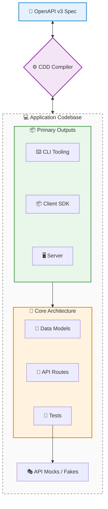

cdd-swift
============

[](https://opensource.org/licenses/Apache-2.0)
[](https://offscale.io/wasm_web_demo)
[](https://github.com/SamuelMarks/cdd-swift/actions)
[](#)
[](#)

**Compiler Driven Development (CDD)** is a development approach designed to eradicate the disconnect between: API specifications; server implementations; client SDKs; and command-line tooling.

Unlike traditional code generators—that treat outputs as disposable or read-only—CDD provides a **complete, standalone compiler** for each supported language. These compilers are fully CST-aware (Concreate Syntax Tree is a whitespace+comment aware Abstract Syntax Tree), allowing true bidirectional synchronization between existing hand-edited source code and OpenAPI specifications.

---

## 🏗️ The Standalone Compiler Architecture

Traditional tools use naïve templating—if you regenerate, your custom code is overwritten.

The CDD ecosystem is fundamentally different. It utilizes language-specific, standalone compilers capable of full AST parsing, semantic diffing, and surgical patching.

**The Core Guarantee:** Every part of the generated codebase is fully editable.
You are encouraged to open the generated routing files, model definitions, and CLI structures, and directly inject your business logic.

- **When your specification changes**, the CDD compiler reads your code, builds an AST, diffs it against the new spec, and safely patches in new endpoints or fields without touching your custom logic.
- **When your codebase changes**, the compiler reverse-engineers your structural updates back into a 100% accurate, authoritative OpenAPI specification.

---

## 🔄 The Bidirectional Synchronization Loop



The CDD lifecycle supports continuous evolution from any starting point:
1. **Generate**: Scaffold servers, SDKs, or CLIs from a central specification.
2. **Edit**: Developers write real, unconstrained code directly in the generated files.
3. **Extract**: Reverse-compile the edited code to produce an updated OpenAPI spec.
4. **Sync**: Apply new specification changes seamlessly into the existing, hand-edited codebase.

---

## 🌐 The Global Language Ecosystem

Every supported language operates on the same core CDD philosophies but is powered by a dedicated, native compiler tailored to that language's specific AST, idioms, and package management.

All implementations share a standardized CLI interface (`cdd [subcommand]`), acting as a universal toolchain.

| Repository | Language | Client; Client CLI; Server | Extra features | Standards | CI Status |
|---|---|---|---|---|---|
| [`cdd-c`](https://github.com/SamuelMarks/cdd-c) | C (C89) | Client; Client CLI; Server | FFI | Swagger 2.0 & OpenAPI 3.2.0 | [](https://github.com/SamuelMarks/cdd-c/actions/workflows/ci.yml) |
| [`cdd-cpp`](https://github.com/SamuelMarks/cdd-cpp) | C++ | Client; Client CLI; Server | Upgrades Swagger & Google Discovery to OpenAPI 3.2.0 | Google Discovery; Swagger 2.0 & OpenAPI 3.2.0 | [](https://github.com/SamuelMarks/cdd-cpp/actions/workflows/ci.yml) |
| [`cdd-csharp`](https://github.com/SamuelMarks/cdd-csharp) | C# | Client; Client CLI; Server | CLR | Swagger 2.0 & OpenAPI 3.2.0 | [](https://github.com/SamuelMarks/cdd-csharp/actions/workflows/ci.yml) |
| [`cdd-go`](https://github.com/SamuelMarks/cdd-go) | Go | Client; Client CLI; Server | | Swagger 2.0 & OpenAPI 3.2.0 | [](https://github.com/SamuelMarks/cdd-go/actions/workflows/ci.yml) |
| [`cdd-java`](https://github.com/SamuelMarks/cdd-java) | Java | Client; Client CLI; Server | | Swagger 2.0 & OpenAPI 3.2.0 | [](https://github.com/SamuelMarks/cdd-java/actions/workflows/ci.yml) |
| [`cdd-kotlin`](https://github.com/offscale/cdd-kotlin) | Kotlin (ktor for Multiplatform) | Client; Client CLI; Server | Auto-Admin UI | Swagger 2.0 & OpenAPI 3.2.0 | [](https://github.com/offscale/cdd-kotlin/actions/workflows/ci.yml) |
| [`cdd-php`](https://github.com/SamuelMarks/cdd-php) | PHP | Client; Client CLI; Server | | Swagger 2.0 & OpenAPI 3.2.0 | [](https://github.com/SamuelMarks/cdd-php/actions/workflows/ci.yml) |
| [`cdd-python`](https://github.com/offscale/cdd-python) | Python | N/A (server building blocks) | CLI ↔ SQL ↔ Pydantic ↔ docs ↔ JSON-schema | N/A | [](https://github.com/offscale/cdd-python/actions) |
| [`cdd-python-all`](https://github.com/offscale/cdd-python-all) | Python | Client; Client CLI; Server |  | Swagger 2.0 & OpenAPI 3.2.0 | [](https://github.com/offscale/cdd-python-all/actions/workflows/ci.yml) |
| [`cdd-ruby`](https://github.com/SamuelMarks/cdd-ruby) | Ruby | Client; Client CLI; Server |  | Swagger 2.0 & OpenAPI 3.2.0 | [](https://github.com/SamuelMarks/cdd-ruby/actions/workflows/ci.yml) |
| [`cdd-rust`](https://github.com/SamuelMarks/cdd-rust) | Rust | Client; Client CLI; Server |  | Swagger 2.0 & OpenAPI 3.2.0 | [](https://github.com/offscale/cdd-rust/actions/workflows/ci.yml) |
| [`cdd-sh`](https://github.com/SamuelMarks/cdd-sh) | Shell (/bin/sh) | Client; Client CLI; Server |  | Swagger 2.0 & OpenAPI 3.2.0 | [](https://github.com/SamuelMarks/cdd-sh/actions/workflows/ci.yml) |
| [`cdd-swift`](https://github.com/SamuelMarks/cdd-swift) | Swift | Client; Client CLI; Server |  | Swagger 2.0 & OpenAPI 3.2.0 | [](https://github.com/SamuelMarks/cdd-swift/actions/workflows/ci.yml) |
| [`cdd-ts`](https://github.com/offscale/cdd-ts) | TypeScript | Client; Client CLI; Server | Auto-Admin UI; Angular; React; Vue; fetch; Axios; Node.js | Swagger 2.0 & OpenAPI 3.2.0 | [](https://github.com/offscale/cdd-ts/actions/workflows/ci.yml) |

---

## 🛠️ Universal CLI Toolchain

A true ecosystem requires standardized tooling. Once a developer learns the CDD toolchain, they can synchronize architecture across the entire polyglot stack.

### Global Arguments

- `--help`: Print help information.
- `--version`: Print version information.
- `--input, -i` (or `-f`): Target file, directory, or OpenAPI spec.
- `--output, -o`: Destination path for generation or sync.

### Core Subcommands

#### `from_openapi to_sdk`
Generate a Client SDK from an OpenAPI specification.

```text
USAGE: cdd-swift from_openapi to_sdk [--input <input>] [--input-dir <input-dir>] [--output <output>] [--no-github-actions] [--no-installable-package] [--tests] [--mcp]

OPTIONS:
  -i, --input <input>     Path to the input OpenAPI JSON file.
  --input-dir <input-dir> Path to a directory containing OpenAPI specifications.
  -o, --output <output>   Path to the output directory. Defaults to current working directory.
  --no-github-actions     Do not generate GitHub Actions workflow.
  --no-installable-package
                          Do not generate installable package scaffolding.
  --tests                 Generate composable tests and mocks.
  --mcp                   Generate Model Context Protocol (MCP) server and adapter.
```

#### `from_openapi to_sdk_cli`
Generate a Client SDK CLI from an OpenAPI specification.

```text
USAGE: cdd-swift from_openapi to_sdk_cli [--input <input>] [--input-dir <input-dir>] [--output <output>] [--no-github-actions] [--no-installable-package] [--tests] [--mcp]

OPTIONS:
  -i, --input <input>     Path to the input OpenAPI JSON file.
  --input-dir <input-dir> Path to a directory containing OpenAPI specifications.
  -o, --output <output>   Path to the output directory. Defaults to current working directory.
  --no-github-actions     Do not generate GitHub Actions workflow.
  --no-installable-package
                          Do not generate installable package scaffolding.
  --tests                 Generate composable tests and mocks.
  --mcp                   Generate Model Context Protocol (MCP) server and adapter.
```

#### `from_openapi to_server`
Generate a Server stub from an OpenAPI specification.

```text
USAGE: cdd-swift from_openapi to_server [--input <input>] [--input-dir <input-dir>] [--output <output>] [--no-github-actions] [--no-installable-package] [--tests] [--mcp]

OPTIONS:
  -i, --input <input>     Path to the input OpenAPI JSON file.
  --input-dir <input-dir> Path to a directory containing OpenAPI specifications.
  -o, --output <output>   Path to the output directory. Defaults to current working directory.
  --no-github-actions     Do not generate GitHub Actions workflow.
  --no-installable-package
                          Do not generate installable package scaffolding.
  --tests                 Generate composable tests and mocks.
  --mcp                   Generate Model Context Protocol (MCP) server and adapter.
```

#### `generate-open-api`
Generate an example OpenAPI JSON document from Swift builder.

```text
USAGE: cdd-swift generate-open-api [--output-path <output-path>]

OPTIONS:
  -o, --output-path <output-path>
                          Path to the output JSON file. Prints to stdout if not provided.
```

#### `to_openapi`
Parse a Swift file to extract Codable models and generate OpenAPI JSON.

```text
USAGE: cdd-swift to_openapi --input <input> [--output-path <output-path>]

OPTIONS:
  -i, --input <input>     Path to the input Swift file.
  -o, --output-path <output-path>
                          Path to the output JSON file. Prints to stdout if not provided.
```

#### `merge-swift`
Merge generated Swift code from an OpenAPI document into an existing Swift file.

```text
USAGE: cdd-swift merge-swift <input-path> <destination-path>

ARGUMENTS:
  <input-path>            Path to the input OpenAPI JSON file.
  <destination-path>      Path to the existing Swift file to merge into.
```

#### `to_docs_json`
Generate JSON documentation with code snippets for an OpenAPI specification.

```text
USAGE: cdd-swift to_docs_json --input <input> [--output <output>] [--no-imports] [--no-wrapping]

OPTIONS:
  -i, --input <input>     Path or URL to the input OpenAPI specification.
  -o, --output <output>   Path to the output JSON file. Prints to stdout if not provided.
  --no-imports            If provided, omit the imports field in the code object.
  --no-wrapping           If provided, omit the wrapper_start and wrapper_end fields in the code object.
```

#### `serve_json_rpc`
Expose CLI interface as a JSON-RPC server.

```text
USAGE: cdd-swift serve_json_rpc [--port <port>] [--listen <listen>]

OPTIONS:
  -p, --port <port>       Port to listen on (default: 8082)
  -l, --listen <listen>   Host to listen on (default: 0.0.0.0)
```

#### `mcp`
Start the Model Context Protocol (MCP) server via stdio.

```text
USAGE: cdd-swift mcp
```

#### `sync`
Bi-directional synchronization of OpenAPI models and Swift definitions.

```text
USAGE: cdd-swift sync [--truth <truth>] --input <input> --output <output>

OPTIONS:
  --truth <truth>         Designate the single source of truth ('class', 'sqlalchemy', 'function').
                          Currently defaults to 'class'. (default: class)
  -i, --input <input>     Path to the input Swift file containing the source of truth.
  -o, --output <output>   Path to the output OpenAPI JSON file to synchronize.
```

### Detail Features Beyond Common Subset

- **Model Context Protocol (MCP):** Generates full MCP servers and adapters (`--mcp`) allowing LLMs and AI editors to introspect or call the API.
- **Smart Merging (`merge-swift`):** AST-aware merging of generated Swift code into existing Swift files without overwriting handwritten logic.
- **Vapor Server Stub:** Scaffolds a full, runnable Vapor-based HTTP server, complete with `Fluent` ORM for SQLite and automated API migrations.
- **Test Generation (`--tests`):** Automatically generates mock instances, test doubles, and XCTVapor tests to establish behavioral correctness.
- **SwiftSyntax Parsing:** Employs the robust `SwiftSyntax` framework to ensure high-fidelity, whitespace-preserving modifications and accurate Swift to OpenAPI reverse-generation.

---

## 🚀 The End of "Spec Drift"

With Compiler Driven Development, specifications and code are no longer loosely coupled artifacts. They are strict, isomorphic reflections of one another, maintained by dedicated standalone compilers.

Choose your language ecosystem above and start treating your architecture as a seamlessly compiled, endlessly editable whole.

---

## License

Licensed under either of

- Apache License, Version 2.0 ([LICENSE-APACHE](LICENSE-APACHE) or <https://www.apache.org/licenses/LICENSE-2.0>)
- MIT license ([LICENSE-MIT](LICENSE-MIT) or <https://opensource.org/licenses/MIT>)

at your option.

### Contribution

Unless you explicitly state otherwise, any contribution intentionally submitted
for inclusion in the work by you, as defined in the Apache-2.0 license, shall be
dual licensed as above, without any additional terms or conditions.
